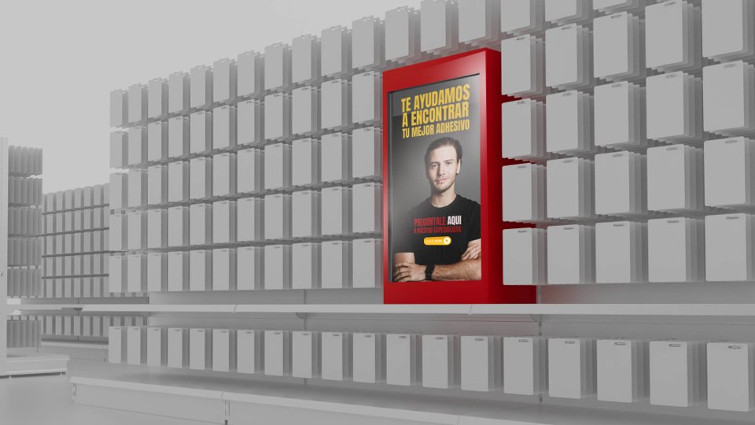

# smartconnect
<!DOCTYPE html>
<html lang="en">
<head>
    <meta charset="UTF-8">
    <meta name="viewport" content="width=device-width, initial-scale=1.0">
    <title>PantallaPrincipal Interactive</title>
    
</head>
<body>
    
    <map name="PantallaPrincipal">
        <area shape="rect" coords="614,355,496,119" href="[PantallaPrincipal.png](https://github.com/Saru1989/smartconnect/blob/main/PantallaPrincipal.png?raw=true)" alt="Icon 1">
    </map>
</body>
</html>
